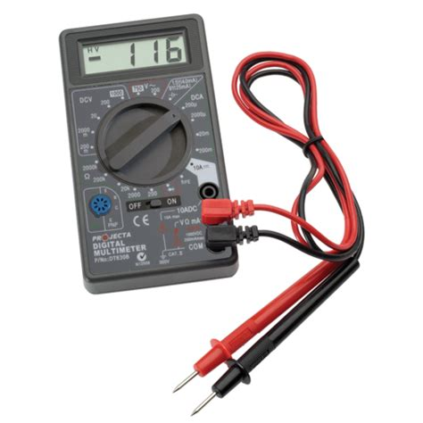

# Use our Network

I've already started a network with two nodes. As a first step, let's try out this network as end-users.

## Apps UI

I think of this UI as a multimeter for Substrate-based blockchains.

You can try out the Apps UI by connecting to:

* Alice's Node: [https://polkadot.js.org/apps/#/explorer?rpc=wss://denver.bootnodes.net/alice](https://polkadot.js.org/apps/#/explorer?rpc=wss://denver.bootnodes.net/alice)
* Bob's Node: [https://polkadot.js.org/apps/#/explorer?rpc=wss://denver.bootnodes.net/bob](https://polkadot.js.org/apps/#/explorer?rpc=wss://denver.bootnodes.net/bob)

You can see we have explicitly set the UI to use a WebSocket endpoint exposed at `wss://denver.bootnodes.net/alice` (or `/bob`). This can be changed on the Settings tab as we'll see shortly.

## Create an Account
Use the `Accounts` tab and `Add Account` to create your own personal account. It will not have any tokens (yet). Paste your address in the notes tab at the end to receive some tokens.

A few ways you can get tokens:
* Transfer from someone who has some
* Sudo call
* Faucet (not installed on our chain)

<!--
## Import an Account
You may import the pre-funded Alice account and borrow some of her tokens. Download the [Alice Key File](https://denver.bootnodes.net/key.json). Then add her account using "Restore JSON".
-->

## Frontend Template

This React-based project serves as starting point for designing your own use-case-specific UIs.

If you're interested in experimenting with this project, you can clone it from:

* https://github.com/substrate-developer-hub/substrate-front-end-template/

<!-- slide:break -->

