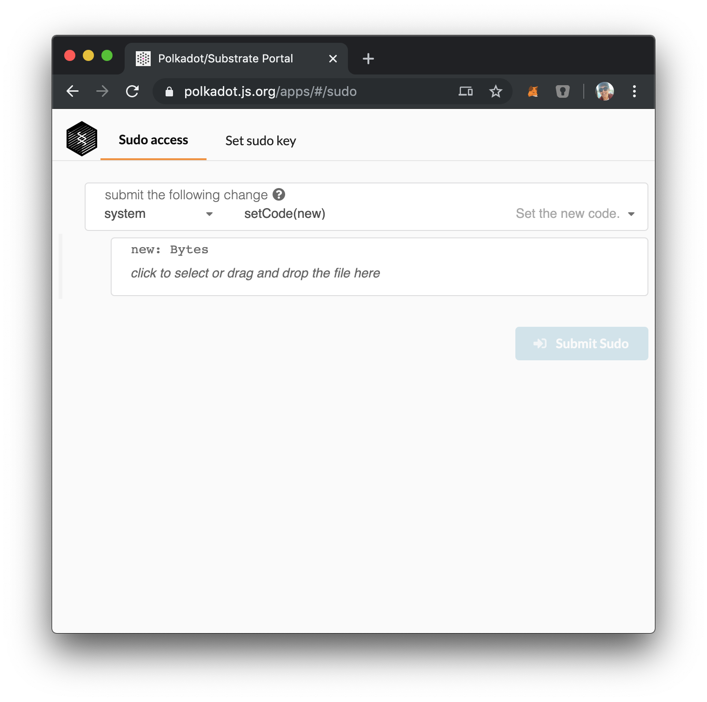

# Runtime Upgrade

Now that we have created a new pallet, let's upgrade our live chain. We'll use the forkless upgrade mechanism described previously.

> Only **one person** should submit the upgrade transaction.

## Compile the new Runtime

Ensure your new runtime is compiled by running `cargo build --release` as we have done before.

For the upgrade, we need the compiled wasm runtime which lives in `target/release/wbuild/node-template-runtime/node_template_runtime.compact.wasm`.

## Submit the Transaction
Upgrading the runtime is serious and you can't just do it willy-nilly. Calling `set_code` directly fails. Instead we make a sudo call.

## About the Sudo Pallet

The `sudo` pallet is a _simple_ governance mechanism where one key gets to be dictator.

It checks that any call submitted to it comes from the authorized person, like your `revoke_claim` function.

More advanced governance is possible. Consider the [Democracy pallet](https://substrate.dev/rustdocs/master/pallet_democracy/index.html) or writing your own custom governance.

<!-- slide:break-60 -->

